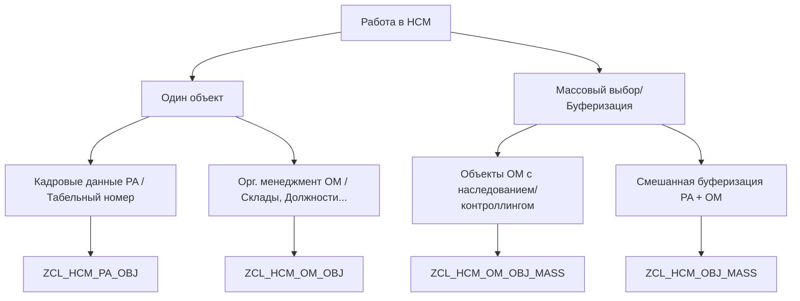

# Утилитарные классы SAP HCM (SIBUR HCM Utility Classes)

Данная директория содержит описания сигнатур (интерфейсов) и примеры использования основных утилитарных классов проекта для модуля SAP HCM. Полный исходный код классов находится в подпапке [full_code/](file:///D:/SIBUR_AI/WORKBENCH/docs/agent-context/references/hcm_utility_classes/full_code/).

---

## 📋 Обзор классов и сценариев использования

В зависимости от задачи (работа с одним сотрудником/объектом или пакетная обработка множества объектов) выберите подходящий класс:



---

### 1. [ZCL_HCM_PA_OBJ](file:///D:/SIBUR_AI/WORKBENCH/docs/agent-context/references/hcm_utility_classes/zcl_hcm_pa_obj.abap)
* **Назначение**: Работа с данными одного сотрудника (Personnel Administration).
* **Когда использовать**: Для чтения ФИО, паспорта, адресов регистрации/фактического, образования, электронной почты, логина (UNAME), начальника, подписантов командировок, орг. единиц, МВЗ, шкал и окладов конкретного сотрудника.
* **Пример использования**:
  ```abap
  " Получение инстанса для табельного номера
  DATA(lo_employee) = zcl_hcm_pa_obj=>get_instance( iv_pernr = '00012345' ).
  
  " 1. Получение ФИО в разном формате
  DATA(lv_fio) = lo_employee->get_fio( iv_is_short = abap_true ). " Иванов И.И.
  
  " 2. Получение email и логина
  DATA(lv_email) = lo_employee->get_email( ).
  DATA(lv_uname) = lo_employee->get_uname( ).
  
  " 3. Получение руководителя
  DATA(lo_boss) = lo_employee->get_boss( ).
  IF lo_boss IS BOUND.
    DATA(lv_boss_fio) = lo_boss->get_fio( ).
  ENDIF.
  ```

---

### 2. [ZCL_HCM_OM_OBJ](file:///D:/SIBUR_AI/WORKBENCH/docs/agent-context/references/hcm_utility_classes/zcl_hcm_om_obj.abap)
* **Назначение**: Работа с одним объектом Организационного менеджмента (OM: орг. единицы `O`, должности `S`, квалификации `C`, и т.д.).
* **Когда использовать**: Для точечного чтения наименований, описаний, связей, путей анализа (wegid), атрибутов (ИТ 1222) с наследованием, подписантов и руководителей орг. единиц.
* **Особенности**: Класс содержит внутренний статический кэш (`mt_cache_*`), что предотвращает повторные вызовы ФМ и снижает нагрузку на БД при частых точечных обращениях к одним и тем же объектам.
* **Пример использования**:
  ```abap
  " Получение инстанса орг. единицы
  DATA(lo_org) = zcl_hcm_om_obj=>get_instance( iv_objid = '50012345' iv_otype = 'O' ).
  
  " 1. Чтение названия и описания (ИТ 1000, ИТ 1002)
  DATA(lv_name) = lo_org->read_description( ).
  
  " 2. Чтение орг. структуры (полной иерархии подчинения)
  lo_org->read_orgstruc(
    IMPORTING
      et_struc       = DATA(lt_struc)
      et_orgeh_struc = DATA(lt_orgeh)
  ).
  
  " 3. Чтение атрибута из ИТ 1222
  DATA(lv_attr_val) = lo_org->get_attribute( iv_attrib = 'COMPANY' ).
  ```

---

### 3. [ZCL_HCM_OM_OBJ_MASS](file:///D:/SIBUR_AI/WORKBENCH/docs/agent-context/references/hcm_utility_classes/zcl_hcm_om_obj_mass.abap)
* **Назначение**: Массовые операции над множеством объектов Организационного менеджмента (OM).
* **Когда использовать**: **Обязательно** при необходимости прочесть данные по списку орг. единиц или должностей. Исключает циклы `LOOP` с точечным чтением БД.
* **Ключевые методы**:
  * `get_mass_controlling_info` — быстрое пакетное чтение параметров контроллинга (БЕ `BUKRS`, раздел персонала `WERKS`, подраздел `BTRTL`) с учетом наследования по орг. структуре вверх (через AMDP/DAO).
  * `get_mass_attrib_w_inherit` — массовое наследование атрибутов ИТ 1222.
  * `read_descriptions` — пакетное чтение STEXT / 1002 текстов.
  * `read_infty` / `read_relation` / `read_wegid` — массовое чтение инфо-типов, связей и путей анализа для пула объектов.
* **Пример использования**:
  ```abap
  " 1. Собираем пул объектов
  DATA(lt_objects) = VALUE hrobject_t(
    ( otype = 'O' objid = '50011111' )
    ( otype = 'O' objid = '50022222' )
  ).
  
  " 2. Инициализируем массовый обработчик
  DATA(lo_mass_om) = zcl_hcm_om_obj_mass=>get_instance( it_objects = lt_objects ).
  
  " 3. Пакетно получаем контроллинговую информацию (с учетом наследования)
  lo_mass_om->get_mass_controlling_info( IMPORTING et_info = DATA(lt_ctrl_info) ).
  " lt_ctrl_info содержит bukrs, werks, btrtl для каждого объекта
  ```

---

### 4. [ZCL_HCM_OBJ_MASS](file:///D:/SIBUR_AI/WORKBENCH/docs/agent-context/references/hcm_utility_classes/zcl_hcm_obj_mass.abap)
* **Назначение**: Массовая буферизация и чтение данных смешанных объектов (PA и OM).
* **Когда использовать**:
  1. При работе со списками табельных номеров (PA) — для пакетной инициализации буфера инфо-типов (`fill_hr_infty_buffer` -> `HR_FILL_BUFFER_MULTIPLE_PERNR`). Это ускоряет последующее чтение через `HR_READ_INFOTYPE` в десятки раз!
  2. При работе со списками объектов OM — для пакетного чтения отношений, описаний и атрибутов.
* **Пример использования**:
  ```abap
  " Инициализируем массовый загрузчик
  DATA(lo_mass) = zcl_hcm_obj_mass=>get_instance( ).
  
  " Добавляем табельные номера для обработки
  LOOP AT lt_pernrs INTO DATA(lv_pernr).
    lo_mass->add_pernr( lv_pernr ).
  ENDLOOP.
  
  " 1. Массово наполняем буфер SAP для ИТ 0001, 0008
  lo_mass->fill_hr_infty_buffer( '0001' ).
  lo_mass->fill_hr_infty_buffer( '0008' ).
  
  " Теперь при последующем вызове HR_READ_INFOTYPE или ZCL_HCM_PA_OBJ
  " обращения к БД происходить не будут — данные возьмутся напрямую из заполненного буфера.
  ```
